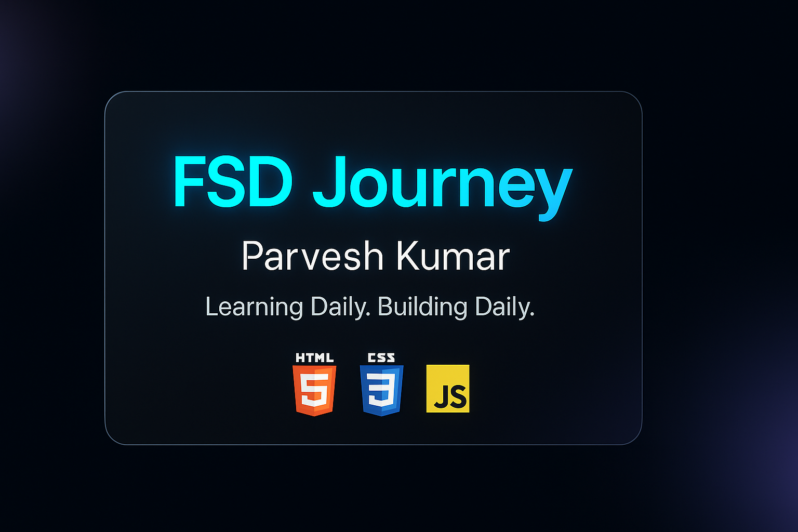

# 🚀 Full Stack Development Journey — Parvesh Kumar


Welcome to my **Full Stack Developer (FSD)** learning journey!  
This repository contains all my daily practice files, tasks, and small projects as I learn to become a complete full-stack developer.

---

## 🔰 Tech Stack I’m Learning


---
## 🔖 About this repository
This repository tracks my **Full Stack Developer (FSD)** learning journey.  
I use a day-by-day folder structure to practice and build small projects that become portfolio pieces.

---

## 📅 **Day-wise Progress**

### 📌 **Day 01 — HTML + CSS + JavaScript + Python + Git**
**Completed Tasks:**
- Built a fully semantic HTML structure  
- Styled the page using Flexbox + responsive layout  
- Added interactive JavaScript (button click → change text)  
- Created a Python script to print even numbers  
- Organized project into folders  
- Pushed all tasks to GitHub using proper Git workflow  
- Added README, badges, and banner
  ---

### 📌 Day 02 — HTML + CSS + JavaScript + Python (Completed)
**Summary:**
- **HTML:** Built a full registration form  
- **CSS:** Centered form, added padding, border-radius, cleaner UI, hover effect  
- **JavaScript:** Form validation + preventDefault + reading values + template-string alert  
- **Python:** Printed names longer than 5 characters (loop + condition + list append)
---
 
### 📌 Day 03 — CSS Flexbox + JavaScript DOM + Python + Django Setup (Completed)
**Summary:**
- **CSS (Flexbox Master Level):** Built 3-box centered layout using gap, justify-content, align-items  
- **JavaScript (DOM Interaction):** Toggle hidden text using querySelector(), style.display, innerText  
- **Python:** Dictionary logic — print students scoring above 80 + count  
- **Django:** Installed Django, created first project folder, verified server runs on localhost
  
---
### 📌 **Day 04 — Django Templates + Static Files + JS + Python (Completed)**
**Summary:**

- Created full Django template structure (templates/myapp/)  
- Built base.html with  + reusable layout  
- Added static files system (css, images, js)  
- Connected CSS + dynamic mobile navigation JS + combined external JS file  
- Created home.html, about.html, and contact.html extending base template  
- Fixed errors: TemplateDoesNotExist, static 404, migrations warning  
- Practiced Python function logic (filter numbers, count vowels, remove duplicates)  
- Tested all pages: Home, About, Contact — fully responsive UI

---

### 📌 **Day 05 — JavaScript + Python + Django Mini Project (Completed)**
**Summary:**

- **JavaScript (UI Level 2):** Built a mini To-Do App with add, delete, mark-complete, clear all, error message, and smooth transitions using HTML + CSS + JS.  
- **Python:** Worked with list of dictionaries — filtered expensive items using loop + append + return and printed names + count.  
- **Django:** Created `todo` app, added templates (`home.html`, `add.html`), added URLs, and built views using temporary list storage (`tasks = []`) to display and add tasks.

---
### 📌 **Day 06 — Python Logic + JavaScript UI Project + Django Update (Completed)**
**Summary:**

- **Python (Medium Logic Task):** Filtered products using `filter_by_price()`, returned only items with price ≥ given minimum, printed **name**, **brand**, **price**, and sorted results using **sorted()** with lambda.  
- **JavaScript (Level-2 UI Project):** Built a **Password Generator App** with password length input, checkboxes for numbers/symbols/uppercase, **Generate** button, password display box, **Copy to Clipboard** button, and smooth password animation.  
- **Django (Important Points):** Created clean folder structure for Day_06, reviewed previous Django work, prepared project for next upgrade (CRUD + models), and practiced proper Django setup and organization.

---

### 📌 **Day 07 — JavaScript Fun Project + Python Easy Task (Completed) ##Rest day**
**Summary:**

- **JavaScript (Fun UI Project):** Built a Random Quote Generator with a centered card, smooth fade animation, New Quote button, copy-to-clipboard feature, and 15–20 quotes stored in an array.  
- **Python:** NamePrint names in reverse order.py, Print only first names in Title Case.py, Python Name Formatter Program.py, User input name Format.py.
  
---
 
### 📌 Day 08 — Python, Django and JavaScript (Completed)
**Summary:**  
- **JavaScript:** Dynamic Card Generator component added (grid, create form, fade-in/out, delete, clear-all). 
- **Python:** Python script list_comprehensions.py with list comprehensions + normal loop equivalents. 
- **Django:** Finished full CRUD for the todo app (Create → Read → Update → Delete).
  
---
### 📌 Day 09 — Python, and JavaScript (Completed)
**Summary:**  
- **JavaScript:** Built a Dark Mode / Light Mode Toggle with. 
- **Python:** Created a User Manager Program: Filter adults (age ≥ 18), Calculate average age, Find the oldest user, Nicely formatted output Practical logic similar to Django queryset filtering.
  
---

### 📌 Day 10 — Python and JavaScript (Completed)
**Summary:**  
- **JavaScript:** Search Filter Component. 
- **Python:** Built a Student Marks Manager Program with clean, reusable functions.
  
---


### 📌 Day 11 — Python and JavaScript (Completed)
**Summary:**  
- **JavaScript:** Modal Popup. 
- **Python:** File Handling Basics.
  
---

### 📌 Day 12 — Python, tailwind and JavaScript (Completed)
**Summary:**  
- **JavaScript:** Live Character Counter,Built a modern UI component with Tailwind + JavaScript. 
- **Python:** Worked with medium-level nested dictionary structures.
- **Tailwind:** Installed Tailwind using CDN, Learned core Tailwind concepts: Utility-first CSS, Flexbox utilities (flex, items-center, justify-between), Background and text colors, Spacing classes (p-4, m-4), Rounded corners + shadows, Hover states (hover:bg-blue-600)
 Built your first Tailwind Card Component with: White card box, Rounded corners, Shadow, Image, Title + description, Button with hover styles, Fully responsive

---

### 📌 Day 13 — Python, tailwind and JavaScript (Completed)
**Summary:**  
- **JavaScript:** Toast Notification System. 
- **Python:** List Comprehension Tasks.
- **Tailwind:** Layout + Navbar + Grid System.

---

### 📌 Day 14 — Python, tailwind and JavaScript (Completed)
**Summary:**  
- **JavaScript:** Tabs Component, 4 tabs: Overview, Projects, Settings, About,Click to switch content, Smooth fade-in animation. 
- **Python:** vTasks focusing on dictionary transformation.
- **Tailwind:** Mini Dashboard UI.

---

### 📌 Day 15 — Python, tailwind and JavaScript (Completed)
**Summary:**  
- **JavaScript:** Accordion Component. 
- **Python:** Lambda Functions + Sorting + Filtering.
- **Tailwind:** TAILWIND FORMS + JS ACCORDION + PYTHON LAMBDA/SORT.

---

### 📌 Day 16 — Python, tailwind and JavaScript (Completed)
**Summary:**  
- **JavaScript:** LocalStorage Notes App (Mini Project). 
- **Python:** Error Handling (try/except Tasks).
- **Tailwind:** Modern Hero Section (Landing Page Top Banner).

---

### 📌 Day 17 — Python, tailwind and JavaScript (Completed)
**Summary:**  
- **JavaScript:** Countdown Timer App. 
- **Python:** Merging & Filtering.
- **Tailwind:** Pricing Section (Professional Landing Page Component).

---

### 📌 Day 18 — Python, tailwind and JavaScript (Completed)
**Summary:**  
- **JavaScript:** Class Methods + Encapsulation. 
- **Python:** Image Carousel / Slider (Auto + Manual).
- **Tailwind:** Testimonials Section (Modern, Beautiful UI).

---

### 📌 Day 19 — Python, tailwind and JavaScript (Completed)
**Summary:**  
- **JavaScript:** Pro-Level Form Validation. 
- **Python:** Sets & Tuples.
- **Tailwind:** Responsive Footer Section.

---

### 📌 Day 20 — Python, tailwind and JavaScript (Completed)
**Summary:**  
- **JavaScript:** Tooltip Component System. 
- **Python:** Mixed List + Dict Problems.
- **Tailwind:** Blog Layout.

---

### 📌 Day 21 — Python and React (Completed)
**Summary:**  
- **React:** React Setup. 
- **Python:** Text cleaner.


---

## 📂 Files included:
```
Day_01/
├── index.html
├── styles.css
├── script.js
└── even_number.py
Day_02/
├── index.html
├── about.html
├── contact.html
├── styles.css
├── script.js
└── filter_names.py
Day_03/
├── index.html
├── about.html
├── contact.html
├── styles.css
├── hidden_message.js
├── python
│   ├── students_score.py
├── django
│   ├──mysite
│   │   ├──mysite
│   │   ├──myapp
│   │   ├──db.sqlite3
└── └── └──manage.py
Day_04/
├── django
│   ├── mysite
├── python_practice
│   ├── filter_numbers.py
│   ├── split_even_odd.py
│   ├── count_long_strings.py
│   ├── remove_duplicates.py
│   └── count_vowels.py
Day_05/
├── js_todo_app/
│   ├── index.html
│   ├── style.css
│   └── script.js
├── python_task/
│   └── expensive_items.py
├── django/
│   ├── manage.py
│   ├── <project_folder>/
│   └── todo/
│       ├── templates/
│       │   └── todo/
│       │       ├── home.html
│       │       └── add.html
│       ├── views.py
│       ├── urls.py
│       └── apps.py
Day_06/
├── django/
│   ├── manage.py
│   ├── mysite/
│   │   ├── mysite/
│   │   ├── db.sqlite3
│   │   ├── todo/
│   │   │   ├── models.py
│   │   │   ├── views.py
│   │   │   ├── urls.py
│   │   │   ├── templates/
│   │   │   │   └── todo/
│   │   │   │        ├── home.html
│   │   │   │        └── add.html
│   │   │   ├── static/
│   │   │   │   └── todo/
│   │   │   │        ├── style.css
│   │   │   │        └── ajax.js
│   │   │   └── apps.py
├── python_task/
│   └── filter_by_price.py
Day_07/
├── Random Qoute Generator/
│   ├── index.html
│   ├──script.js
│   └──style.css
└── python/
│   ├──Print names in reverse order.py
│   ├──Print only first names in Title Case.py
│   ├──Python Name Formatter Program.py
│   └──User input name Format.py
Day_08/
├── django/
│   ├── todo/
├── frontend/
│   ├── dynamic_cards.html 
└── python/
    └── list_comprehensions.py
Day_09/
├── JavaSrcipt/ dark_light_mode/
│   ├── index.html
│   ├── style.css
│   └── script.js
└── Python/python_user_manager/
│    └── user_manager.py
Day_10/
├── Python/
│   └── student_marks_manager.py
└── JaveScript/
│    ├── index.html
│    ├── style.css
│    └── search.js
Day_11/
├── JavaScript/
│   ├── index.html
│   ├── style.css
│   └── modal.js
└── Python/
│   ├── students.txt
│   ├── topers.txt
│   └── file_handler.py
Day_12/
├── Python/
│   └── Dictonary Logic.py
├── Tailwind/
│   └── index.html
└── JS/
    └── index.html
Day_13/
├── Python/
│   ├── list_comprehension + filter.py
├── JS/
│   ├── index.html
│   └── toast.js
└── Tailwind_Layout/
    └── index.html
Day_14/
├── Python/
│   ├── Dictionary_transformation.py
├── JS/
│   ├── index.html
│   └── tabs.js
└── Tailwind_Layout/
    └── index.html
Day_15/
├── Python/
│   ├── Lambda Function + Sorting + Filtering.py
├── JS/
│   ├── Accordion.html
└── Tailwind/
    └── index.html
Day_16/
├── Python/
│   ├── Error handle.py
├── JS/
│   ├── JS local storage index.html
└── Tailwind/
    └── Tailwind hero index.html
Day_17/
├── Python/
│   ├── Merging and Filtering.py
├── JS/
│   ├── index.html
│   └── app.js
└── Tailwind/
    └── index.html
Day_18/
├── Python/
│   ├── Class Methods + Encapsulation.py
├── JS/
│   ├── index.html
│   └── app.js
└── Tailwind/
    └── index.html
Day_19/
├── Python/
│   ├── tuple.py
├── JS/
│   ├── index.html
│   └── app.js
└── Tailwind/
    └── index.html
Day_20/
├── Python/
│   ├── List+Dic.py
├── JS/
│   ├── index.html
│   └── app.js
└── Tailwind/
    └── index.html
Day_21/
├── Python/
│   ├── List+Dic.py
Day_22/
├── Python/
│   ├── List+Dic.py
Day_23/
├── Python/
│   ├── List+Dic.py
└── React_01/
Day_23/
├── Python/
│   ├── List+Dic.py
└── React_01/
Day_23/
├── Python/
│   ├── List+Dic.py
└── React_01/
└── README.md

```

---

## 🧠 Purpose & Goals of This Repository
This repository is created to:

-Track daily learning and progress.

-Build real projects to demonstrate skills.

-Practice Git & GitHub workflows.

-Prepare a portfolio for job applications.

---
###🤝 Contributing & Feedback

I’m learning and welcome feedback. If you see something I can improve (code, structure, accessibility), please open an issue or a PR.

---
❤️ Support & Contact

If you like my progress, please ⭐ the repo — it motivates me to keep building!

Contact: pk8352082260@gmail.com

---

## 🛠️ Technologies I’m Learning

### **Frontend**
- HTML5
- CSS
- JavaScript(process)
- React (planned)
- node.js (planned)

### **Backend**
- Python
- Django / Django REST Framework
- APIs & JSON
-JavaScript

### **Tools**
- Git & GitHub
- VS Code
- Browser DevTools

---

> More updates coming soon… 🚀🔥
